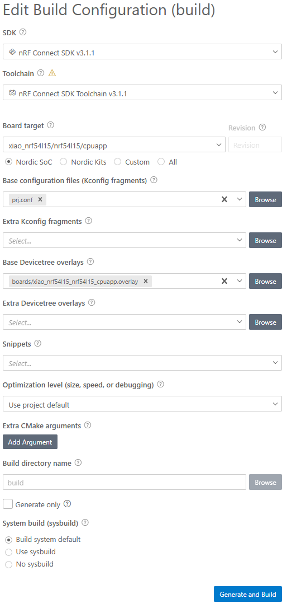
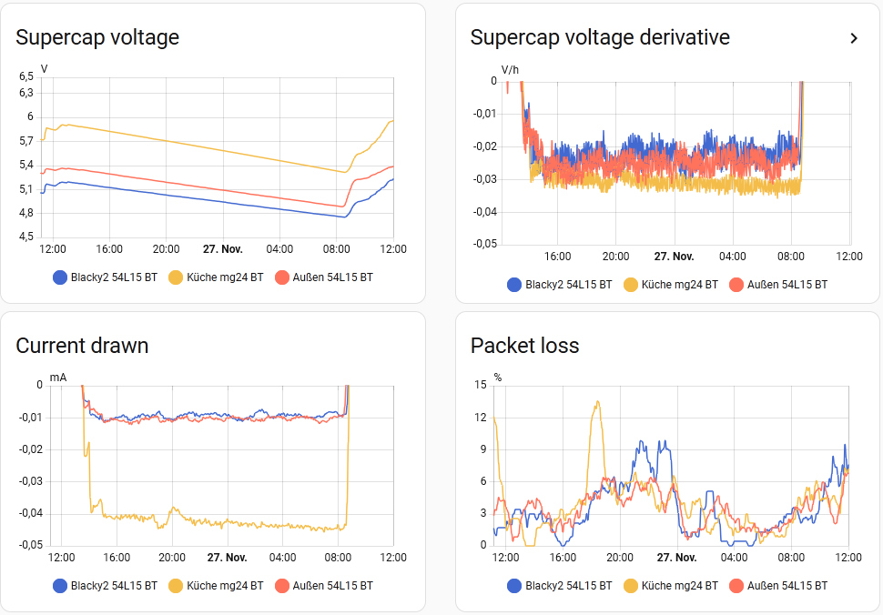

# BTHomeV2 XIAO nrf54l15 example

Requirements:
- Setup nRFConnect SDK as described here: https://wiki.seeedstudio.com/xiao_nrf54l15_sense_getting_started/
- In Visual Studio Code, open folder examples/XIAO_nrf54L15
- Select nrf Connect in Activity Bar
- Select 'Add build configuration'
- Choose Board target, Base configuration files and Base Devicetree overlays, perform 'Generate and Build'

- Connect a BME280 or BMP280 breakout board (3V3 version prefered) with XIAO nrf54l15 using standard pins
- Connect XIAO nrf54l15 via USB
- Do a 'west flash'

The sensor should show up in Home Assistant

What to expect?

These sensors are solar powered by small panels with 5V or 6V. The panel charges a supercap with 1.5F (54L15) or 5F (MG24). This is a perfect setup to measure the average power consumption (or average current): MG24 ~40µA, 54L15 ~10µA.

Packet loss is calculated with the help of a counter which increments with every sent packet:
- Setup two HA helpers statistics with max age 1h
- one with count (=packets received per hour)
- the other with change (=packets sent per hour)
- Another helper (template) with formula 1 - received_per_hour/sent_per_hour gives the packet loss percentage